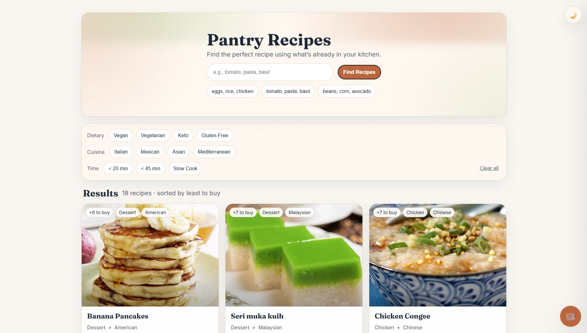
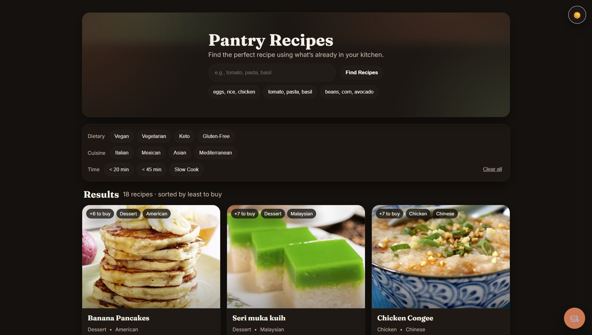
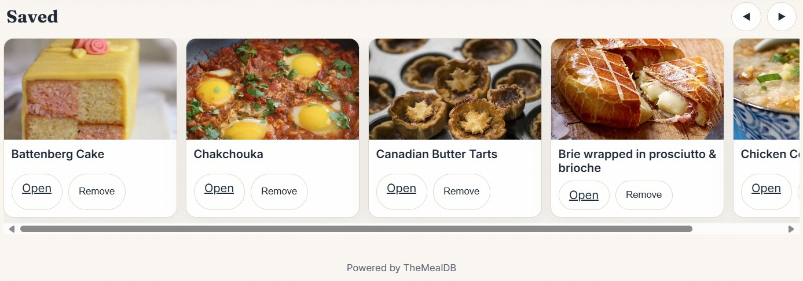
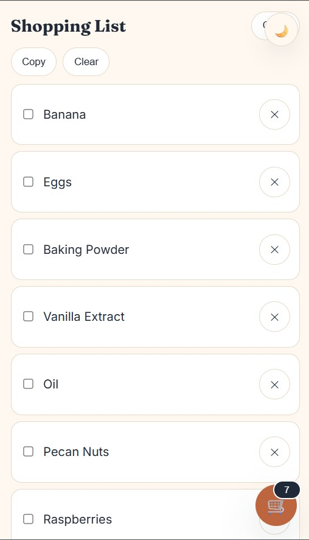
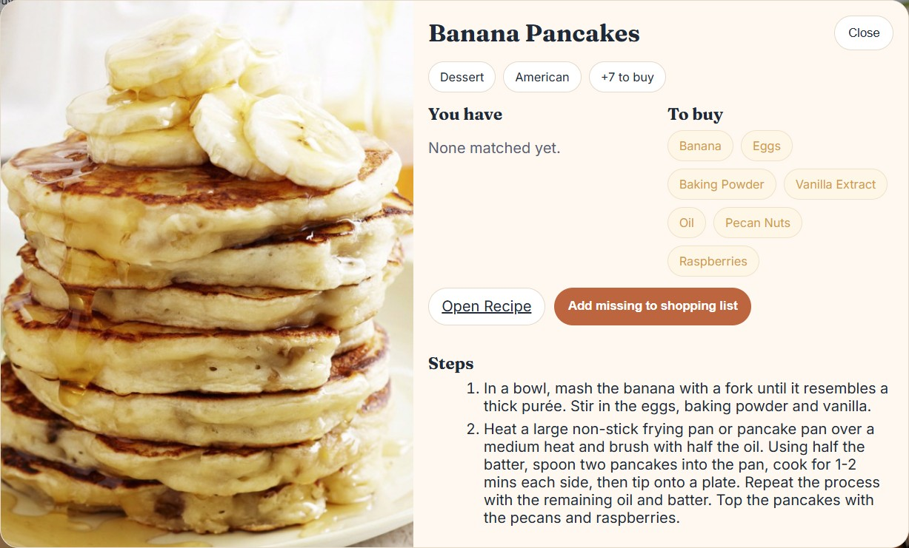

# 🥘 Pantry Recipes

Pantry Recipes is a simple app designed to help you track what’s in your pantry, save recipes, and automatically generate shopping lists.  
It features a clean design with both light and dark modes for easy use in any environment.

---

## ✨ Features
- 🌗 **Dark & Light Mode** toggle  
- 📝 **Save pantry items** and recipes  
- 🛒 **Auto-generate shopping lists** from missing ingredients  
- 📱 **Responsive and clean UI** for desktop and mobile  

---

## 📸 Screenshots


| Light Mode | Dark Mode |
|------------|-----------|
|  |  |

| Saved Pantry | Shopping List | Detailed Recipe |
|--------------|---------------|-----------------|
|  |  |  |

---

## 🚀 Getting Started

### Prerequisites
Make sure you have installed:
- **Node.js** (if it’s a JS/React app)  
or  
- **Python 3.x** (if it’s a Flask/Django app)

---

### Installation

Clone the repository:

```bash
git clone https://github.com/20mup/pantry-recipes.git
cd pantry-recipes
```

Install dependencies:

```bash
# Node.js
npm install

# OR Python
pip install -r requirements.txt
```

---

### Run the App

```bash
# Node.js
npm start

# OR Python
python app.py
```

---

## 📂 Project Structure
```
pantry-recipes/
├── app/                # main app code
├── screenshots/        # UI screenshots
├── requirements.txt    # dependencies (Python)
├── package.json        # dependencies (Node.js)
├── README.md           # this file
└── .gitignore
```

---

## 📜 License
This project is licensed under the MIT License – feel free to use and modify.

---

## 👨‍💻 Author
Developed by **Mousa Pirzada**  
[Portfolio](https://mousapirzada.vercel.app) • [GitHub](https://github.com/20mup) • [LinkedIn](https://www.linkedin.com/in/mousa-pirzada/)
